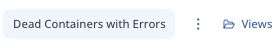

Explorer page consist of 2 big sections: [Controls](#controls) & [Results](#results)

## Controls

### Buttons
- **Search**: Initiates a query to retrieve data.
- **Share URL**: Copies the current selection and filters to the clipboard as a shareable URL.
- **Download**: Downloads the current selection in JSON format.

### Limit Selector
Specifies how many rows of data should be retrieved from the server and displayed on page.

### Time Range Selector

Defines the time range for data retrieval, allowing either exact dates or a relative time period.

### Query setup
The Query setup button opens a menu with settings related to query configuration. Currently,
it allows you to enable or disable the raw query editor for the selected source.

### Graph Setup

The **Graph setup** button opens a menu with settings for configuring graph visualization. Currently, it allows you to:

- **Toggle graph visibility** – Enable or disable the display of the graph.
- **Set Group By column** – Choose a column to group data in the graph.

Grouping is also supported for JSON, Map or Array column types using the colon (`:`) notation. (Refer to the [Columns input documentation](columns.md#working-with-json-map-and-array-columns) for more details on accessing nested data).

### Columns Input
A detailed description of the `columns input` is located on a separate [page](./columns.md).

### Query input
A detailed description of the `query input` is located on a separate [page](./query.md).

### Raw Query input
A detailed description of the `raw query input` is located on a separate [page](./raw_query.md).

### Saved views

A detailed description of the `saved views` is located on a separate [page](./saved_views.md).

## Results

### Graph Representation
The graph is currently built based on the severity column, which is specified in the source and this is the only available behavior at the moment. In the future, there will be an option to build the graph based on any arbitrary key.

:::tip[Severity for Docker/Kubernetes sources]
For Docker and Kubernetes sources, severity can be extracted from log message bodies using **severity rules**. This enables the same rich visualization as ClickHouse sources with dedicated severity columns. See [Severity Rules](/concepts/severity-rules) for details.
:::

If the number of rows displayed on the screen does not match the range of the graph, the visible area of the retrieved and displayed rows is highlighted on the graph. This allows users to easily correlate the data in the table with its graphical representation, ensuring that they do not lose track of which rows have been loaded and displayed.

This visualization mechanism improves data navigation, especially when dealing with large log volumes where the full range of values may exceed the current viewable window. Example below.

### Result Table
The resulting table **always contains a time column**, which is defined in the source. Row colors are determined based on the severity column from the source. This ensures that rows with the same severity have the same color. Also, row colors match graph colors.

:::caution
If the data reaches the limit, a message will be displayed indicating that only a subset of the matching entries is shown. For example:

**"Displaying limited results: Only 500 out of 4,248 matching entries are shown. Refine your filter or adjust the limit to view more."**

This informs the user that additional matching data exists but is not currently displayed due to the result limit. To access more entries, users can refine their filters to narrow the results or increase the limit if supported.
:::

### Detailed View

Clicking on a row opens a detailed view in a modal window that takes up half of the screen. This detailed view displays all keys and values for the selected log entry. **JSON paths are automatically flattened** for easier readability (as seen in the screenshot). There is also an option to view the entry in raw JSON format.