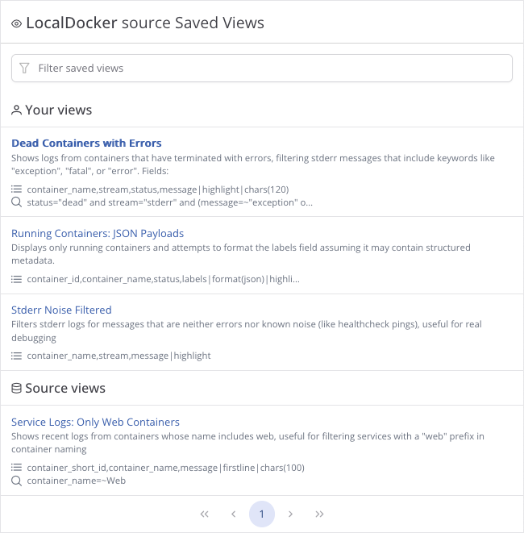

Saved Views in Telescope make it easy to preserve and reuse custom configurations of the Explorer.
Instead of manually setting filters or fields every time, you can save them as named presets and switch between them
like bookmarks.
Unlike browser bookmarks, Saved Views support full-text search, sharing, and better integration with the system.




## Purpose

Saved Views simplify repetitive workflows by allowing users to:

* Quickly switch between different perspectives of log data
* Share useful views with teammates
* Avoid storing raw URLs in external tools or bookmarks

## Always Bound to a Source

Every Saved View is always associated with a specific **Source**. There are no standalone views.
When no view is explicitly selected, Telescope uses a **default view**, which reflects the default configuration of the
current source.

## View Scopes

There are two types of Saved Views:

### Personal Views

* Created by a user for a specific source
* Only visible by the creator by default
* Can be marked as `shared`, which allows any user with access to the source to use (but not edit) it
* If a user loses access to the source, all related views become inaccessible
* Only the creator can edit or delete their personal views
* Can be changed to source scope at any time if the user has permission to edit the source

### Source Views

* Exist at the source level and are available to any user who has access to the source
* Editable by users with source-edit permissions

## View List Ordering & Search

When displaying saved views:

1. Personal views of the current user
2. Source-level views
3. Shared views created by others

Telescope uses full-text search across view name, description, filters, fields, and other saved parameters.

## Limits

Administrators can control the number of views a user can create via the configuration file.
By default, the limit is `0`, meaning **no restriction**.

```yaml
limits:
  max_saved_views_per_user: 0
```

## Activation and Execution

When a Saved View is selected:

* All stored parameters are applied to the Explorer
* The data is not immediately fetched - you must press **Execute** to run the query and see the results

## Creating a View

To create a view:

* Open the "Views" menu and select **"Save new view as..."**
* Provide a name, scope (`personal`/`source`), and optional description
* A URL-friendly `slug` is automatically generated from the name (slug regeneration may be added later)

This slug is used in the URL, so it clearly reflects the view's purpose.

## Actions in the Views Menu

Depending on permissions and state:

* **Save new view as...** – Create a new view from the current state
* **Reset to default view** – Revert to the system default view
* **Save** – Overwrite the current view with updated fields, filters, etc. (name and description stay unchanged)
* **Edit view** – Modify name, description, scope, or sharing options
* **Delete** – Remove the view (if the user has permission)

## URL Behavior

After selecting a view and running **Execute**:

* The URL includes only the `view` parameter (e.g. `?view=errors-by-service-4b7fc23`)
* If the user modifies filters or fields, the URL is updated accordingly
* Partial overrides are supported-— e.g. a view may define filters and fields, but you can adjust them without breaking
  the base view reference

## Stored Parameters

A Saved View currently stores:

* Fields data
* FlyQL query
* Raw SQL `WHERE` query (if used)
* Time range (`from` / `to`)
* Graph settings (visibility, group by field)
* Limit
* Context fields (e.g. container names for Docker sources)

## Future Work

* A dedicated management page for personal views
* Slug regeneration by request
* Usage statistics for view